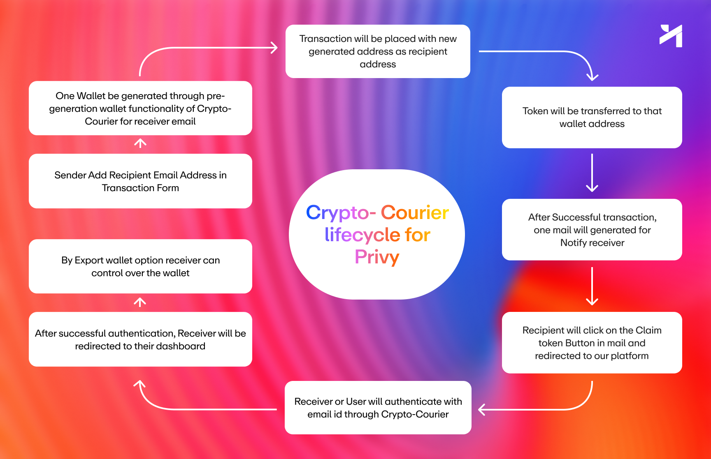

# CryptoCourier


## Index
- [Overview](#overview)
- [Problem Statement](#problem-statement)
- [Solution Details](#solution-details)
  - [Email-Based Crypto Gifting](#email-based-crypto-gifting)
  - [Account Abstraction using Privy](#account-abstraction-using-privy)
  - [Automatic Wallet Creation](#automatic-wallet-creation)
  - [Gas Fee Subsidization](#gas-fee-subsidization)
- [Benefits](#benefits)
- [Challenges Faced](#challenges-faced)
- [Privy Flow](#privy-flow)
- [Demo Video and Pitch Deck](#demo-video-and-pitch-deck)
- [Setup Instructions](#setup-instructions)
- [Conclusion](#conclusion)

## Overview
CryptoCourier simplifies the onboarding process into the cryptocurrency world by enabling seamless email gifting of crypto, making it accessible for non-crypto users. 🎉

## Problem Statement
Non-crypto users often face barriers when trying to enter the cryptocurrency space, including the complexity of wallets, public keys, and blockchain technology. CryptoCourier aims to eliminate these hurdles, facilitating a smoother onboarding experience. ❌

## Solution Details

### Email-Based Crypto Gifting
Users can easily send cryptocurrency via email, removing the need for recipients to understand wallets or blockchain intricacies. 📧

### Account Abstraction using Privy
This integration enhances security and provides a streamlined user experience, making the process safer for users. 🔐

### Automatic Wallet Creation
CryptoCourier automatically creates wallets for new users during the gifting process, removing entry barriers. 🛠️

### Gas Fee Subsidization
The platform helps reduce financial burdens for first-time users by subsidizing gas fees. 💰

## Benefits
- **Enhanced Accessibility:** Makes it easier for anyone to enter the crypto world. 🌍
- **User-Friendly Interface:** Bridges the gap between traditional communication methods and blockchain technology. 🖥️
- **Increased Adoption:** Encourages wider adoption of cryptocurrency by simplifying the onboarding process. 📈

## Challenges Faced
- **User Education:** Ensuring new users understand the importance of wallet security and managing private keys.
- **Technical Integration:** Implementing and integrating multiple technologies, such as Privy and RainbowKit, into the platform. 

Despite the challenges, CryptoCourier has proven to be a feasible solution for onboarding new users into the crypto ecosystem, validating its benefits through user testing and feedback. 🚀

## Privy Flow


## Demo Video and Pitch Deck
Watch our demo video on YouTube to see CryptoCourier in action: [CryptoCourier Demo Video](https://www.youtube.com/watch?v=MmHiKaBAjc0)

Live Demo: [Live Demo Link](https://courier-by-crypto-courier.vercel.app/)

Pitchdeck: [Pitchdeck](./src/assets/pitchdeck.pdf)

## Setup Instructions
To set up and run the CryptoCourier project locally, follow these steps:

1. **Clone the Repository:**
   ```bash
   git clone https://github.com/Crypto-Courier/crypto-courier
   cd CryptoCourier
   ```
2. **Install Dependencies:**
    ```bash
    npm install
    ```
    or
    ```bash
    yarn
    ```
4. **Add Environment Variable in .env.local:**
    ```bash
    NEXT_PUBLIC_PRIVY_APP_ID
    NEXT_PUBLIC_PRIVY_APP_SECRET
    BTTC_API_KEY
    MONGODB_URI
    SENDGRID_API_KEY
    SENDGRID_VERIFIED_SENDER
    ```
    Source For Environment Variable:
    [Privy](https://www.privy.io/)
    [BTTC](https://docs.bttcscan.com/getting-started/viewing-api-usage-statistics/)
    [MongoDB](https://www.mongodb.com/)
    [Sendgrid](https://sendgrid.com/en-us/)

3. **Run the Development Server:**
    ```bash
    npm run dev
    ```
    or 
    ```bash
    yarn dev
    ```

## Conclusion
CryptoCourier effectively bridges the gap between traditional communication methods and the cryptocurrency ecosystem. By simplifying the onboarding process, we empower non-crypto users to easily enter the world of digital assets. Through innovative features like email-based gifting, automatic wallet creation, and gas fee subsidization, CryptoCourier fosters a more inclusive and accessible environment for everyone. Our ongoing commitment to user education and feedback ensures that we continuously improve and adapt to the needs of our users, driving wider adoption of cryptocurrency. Thank you for exploring CryptoCourier! 🚀
